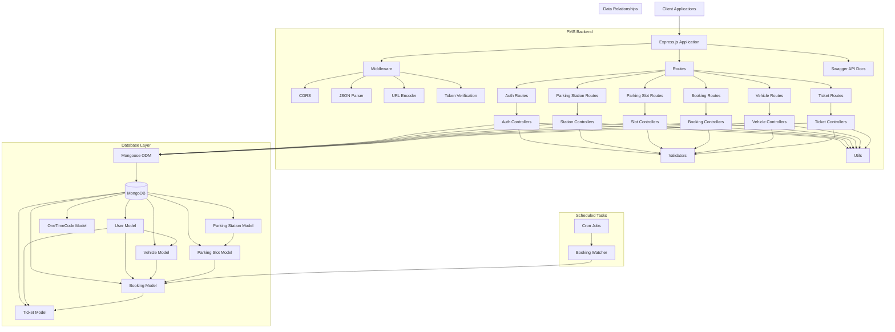

# Parking Management System Backend Architecture - Mermaid Diagram

Below is a visual representation of the PMS backend architecture using Mermaid diagram syntax. This can be rendered in GitHub, GitLab, or any Markdown viewer that supports Mermaid.

## System Architecture Diagram

## Component Descriptions

### Client Layer
- **Client Applications**: Web and mobile applications that consume the PMS backend APIs

### Application Layer
- **Express.js Application**: The main web framework handling HTTP requests and responses
- **Middleware**: Components that process requests before they reach the route handlers
  - CORS: Enables cross-origin resource sharing
  - JSON Parser: Parses JSON request bodies
  - URL Encoder: Parses URL-encoded request bodies
  - Token Verification: Authenticates and authorizes API requests
- **Routes**: Define API endpoints and direct requests to appropriate controllers
- **Controllers**: Contain business logic for handling API requests and responses
- **Validators**: Validate input data before processing
- **Utils**: Utility functions used throughout the application
- **Swagger API Docs**: API documentation and testing interface

### Database Layer
- **Mongoose ODM**: Object Data Modeling library for MongoDB and Node.js
- **MongoDB**: NoSQL database for storing application data
- **Models**:
  - User: User account information
  - Vehicle: Vehicle information
  - ParkingStation: Parking facility information
  - ParkingSlot: Individual parking space information
  - Booking: Parking reservation details
  - Ticket: Parking ticket information
  - OneTimeCode: Verification codes for authentication

### Scheduled Tasks
- **Cron Jobs**: Scheduled tasks for monitoring bookings and other time-sensitive operations

## Key Workflows

### Authentication Flow
1. User registers with email, password, and personal information
2. Verification code is sent to user's email
3. User verifies account with code
4. User logs in and receives JWT token
5. Token is used for subsequent authenticated requests

### Booking Flow
1. User selects parking station
2. User views available parking slots
3. User books a slot for a specific time period
4. System generates booking confirmation
5. User receives ticket for the booking